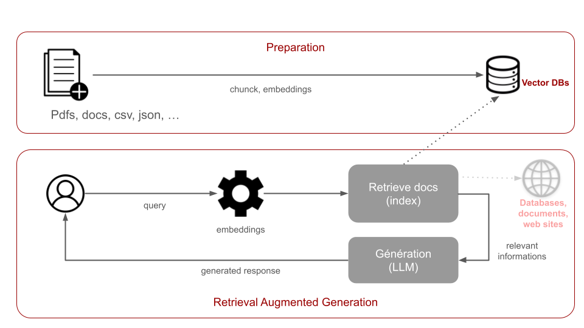

# CodeLab GenAI Zenika - Python


## Installation

Pour lancer ce projet vous avez besoin:

- Python 3.9+
- Poetry

Une fois les outils installer, vous pouvez installer les dépendances via la commande: 

````bash
poetry install
````

Le suite du codelab aura lieu dans `src/app.py`


Assurez-vous également que `Ollama` est démarré, accessible et que le modèle Mistral7B est bien disponible.
Pour cela vous pouvez accéder à l'URL suivante: (http://localhost:11434/api/tags)[http://localhost:11434/api/tags] et valider que Mistral est bien présent.

## Premier pas

Maintenant que tout est installé, nous allons pouvoir démarrer notre première application. 

Afin d'appeler notre modèle, nous allons utiliser (LangChain)[https://www.langchain.com/]. 

LangChain Community contient les intégrations pour les applications tierce comme Ollama.

Dans votre fichier `src/app.py`, vous pouvez ajouter l'import suivant :

```python
from langchain_community.llms import ollama
```

Notre modèle est actuellement accessible via l'URL `http://localhost:11434`

Nous allons créer l'objet permettant d'intéragir avec Ollama via le code suivant: 

```python
llm = ollama.Ollama(
    base_url=OLLAMA_URL, 
    model='openhermes',
)
```

Une fois cet objet créé nous allons pouvoir intéragir avec le modèle openhermes. 
Pour cela on déclare un prompt: 

```python
prompt = 'Who are you ?'
```

Puis on invoque le modèle :

```python
response = llm.invoke(prompt)
print(response)
```

Pour exécuter le fichier, exécuter la commande suivante: 

```python
poetry run python src/app.py
```

Et voila! Nous avons effectué notre premier appel. 

## Améliorons notre modèle

LangChain fournit un ensemble de fonction et d'utilitaire permettant de configurer plus finenement notre application. 

### Streaming 

Dans un premier temps, rendons notre application un peu plus vivante. Plutôt que de générer une réponse d'un coup, LangChain nous permet de streamer le flux de la réponse.

Pour cela, ajouter les imports suivants:

```python
from langchain.callbacks.manager import CallbackManager
from langchain.callbacks.streaming_stdout import StreamingStdOutCallbackHandler
```

Modifier la création de notre objet `llm` pour y ajouter un `callback_manager` permettant de streamer la réponse:

```python
llm = ollama.Ollama(
    base_url=OLLAMA_URL, 
    model='openhermes',
    callback_manager= CallbackManager([StreamingStdOutCallbackHandler()])
)
```

Réexecuter le fichier pour voir la différence:

```python
poetry run python src/app.py
```

### Temperature 

Afin de générer des variations dans les réponses apportées par les modèles, il est possible de faire varier le paramètre `temperature`. Il permet de définir le degré de "créativité" du modèle. En effet, la sortie d'un modèle de langage génératif basé sur les transformers est la suite de token (que par simplicité nous pouvons considérer comme des mots) qui complète la suite de token (ou mots) donnés en input. Grâce aux poids réglés lors du préentrainément, le modèle détermine les tokens qui ont la probabilité la plus grande de compléter une suite fournie en entrée. Par défaut, il choisit toujours ceux qui ont la probabilité la plus haute. Agir sur la température permet d'augmenter l'ensemble des tokens choisis, en allant chercher ceux qui ont des probabilités plus basse de survenir.
Ce paramètre (compris entre 0 et 1).
Plus la valeur est proche de 1, plus le modèle va être "créatif", c'est à dire qu'il choisira des mots moins probables de survenir d'après les dataset qui ont servi à l'entrainé.
Plus la valeur est proche de 0, plus le modèle va être déterministe, il choisira toujours le mots avec la probabilité la plus élevée.

--- 
> Règles de bases
>
>* Pour des taches de transformation (correction de fautes, extraction de données, conversion de format) on vise une temperature entre 0 et 0.3
>* Pour des taches d'écriture simple, de résumé, on vise une température proche de 0.5
>* Pour des taches nécessitant de la créativité (marketing, pub), on vise une température entre 0.7 et 1
---

Pour configurer la temperature, modifier la déclaration du modèle:

```python
llm = ollama.Ollama(
    base_url=OLLAMA_URL, 
    model='openhermes',
    temperature=0.5,
    callback_manager= CallbackManager([StreamingStdOutCallbackHandler()])
)
```
## Conversation

### Prompt template

Afin d'éviter la répétition, LangChain nous donne la possibilité de variabiliser notre prompt.

Pour cela, ajoutez l'import suivant:

```python
from langchain_core.prompts import ChatPromptTemplate
```

Déclarer votre template:

```python
prompt = ChatPromptTemplate.from_messages([
    ('system', 'You are a professional regexp instructor'),
    ('user', 'explain the following regexp {regexp} ')
])
```

Langchain permet de creér des `chain`, un enchainement de fonction. Les fonctions vont consommer les réponses des fonctions précédentes. 

Nous pouvons créer notre `chain` via le code suivant:

```python
chain = prompt | llm
```
Ce code est écrit avec LCEL (LangChain Expression Language). 

L'invocation de notre modèle se fait maintenant en appelant:

```python
print(chain.invoke({'regexp': '^[\w-\.]+@([\w-]+\.)+[\w-]{2,4}$'}))
```


## One Shot / Few Shot learning

Il existe différente technique permettant de contextualiser les réponses. Une première technique consiste à passer des 
exemples de questions / réponses dans le contexte. 
On peut faire notre propre template de prompt ou utiliser directement un prompt pré-configuré par LangChain:

```python
from langchain.prompts import FewShotChatMessagePromptTemplate
```

Dans un premier temps, on commence par définir un ensemble d'exemple qui vont aider notre modèle à répondre:

```python
examples = [
    {'animal': 'cow', 'sound': 'moo'},
    {'animal': 'cat', 'sound': 'meow'},
    {'animal': 'dog', 'sound': 'woof'}
]
```

On créé ensuite un template de prompt pour y injecter nos exemple:

```python
example_prompt = ChatPromptTemplate.from_messages([
    ('human', '{animal}'),
    ('ai', '{sound}')
])
```

Initialiser le template contenant tous les exemples ainsi que la question:

```python
few_shot_prompt = FewShotChatMessagePromptTemplate(
    examples=examples,
    example_prompt=example_prompt,
)
```

Une fois le prompt créé, on peut assembler nos exemples dans un prompt final: 

```python
final_prompt = ChatPromptTemplate.from_messages([
    ('system',
     'You are an animal sound expert, able to give the sound an animal does based on the name of the animal'),
    few_shot_prompt,
    ('human', '{input}')
])
```

Pour invoquer notre modèle:

```python
chain = final_prompt | llm

print(chain.invoke({'input': 'lion'}))
```


## Prompt pré-configuré

Langchain nous propose un ensemble de pré-configuré. Dans cet exemple, nous allons utiliser la `chain`: `load_summarize_data`
qui n'ait rien d'autre qu'un template de prompt:

```
prompt_template = """Write a concise summary of the following:
{text}
CONCISE SUMMARY:"""
```

### Résumé d'un texte: 

Pour résumer un texte, on peut se baser sur la fonction `load_summarize_data`

```python
from langchain.chains.summarize import load_summarize_chain
```

L'utilisation de cette `chain` ce fait de la façon suivante:

```python
chain = load_summarize_chain(llm, chain_type="refine")
```

En plus de fournir des prompt pré-enregistré, LangChain fournit également un ensemble de classe utilitaire permettant de charger différent type de données: JSON, CSV, lien web, ...

Pour notre example, nous allons utiliser le `WebBaseLoader`

```python
from langchain_community.document_loaders import WebBaseLoader
```

Prenons par exemple le contenu d'une page wikipédia: https://fr.wikipedia.org/wiki/Grand_mod%C3%A8le_de_langage

```python
loader = WebBaseLoader('https://fr.wikipedia.org/wiki/Grand_mod%C3%A8le_de_langage')
docs = loader.load()
print(chain.invoke(docs))
```

Cette technique fonctionne pour les documents ayant une taille suffisamment petite pour injecter dans le contexte du LLM. 

Dans le cas d'un long document, il sera nécéssaire de découper notre document. On peut s'orienter vers des solutions de type RAG


## Et si il avait un peu de mémoire ? 

Par défaut, chaque invocation au modèle se comportera comme si c'était la première.
Afin de simuler une conversation, il est possible de configurer une mémoire à notre modèle. 

Pour ce faire, on peut utiliser un template de prompt qui va assembler un historique de nos message à chaque nouvelle inférence. 

Langchain nous propose un objet permettant de gérer un historique de message:

```python
from langchain.memory import ChatMessageHistory

chat_messages = ChatMessageHistory()
chat_messages.add_user_message('Can you translate I love programming in French')
chat_messages.add_ai_message("J'adore la programmation")
```

Comme pour résumé un document, langchain nous propose une `chain` pré-configuré permettant d'inclure une memoire. 

Pour cela, nous allons nous basé sur la classe`ConversationChain`, et sur la classe `ConversationBufferMemory` pour la gestion de la mémoire

```python
from langchain.chains import ConversationChain
from langchain.memory import ConversationBufferMemory
```

La conversation et la mémoire peuvent être instanciés de la façon suivante:

```python
memory = ConversationBufferMemory(chat_memory=chat_messages)
conversation_chain = ConversationChain(llm=llm, memory=memory)
```

Et inféré via l'appel à la méthode `predict`:

```python
conversation_chain.predict(input="what was my previous question ?")
```

## Et pourquoi pas une interface ?

Pour pouvoir échanger avec votre assistant de manière graphique nous vous proposons de créer une interface avec [Streamlit](https://streamlit.io/).

Créez un fichier dans `src/ui/py` avec ce contenu : 

```python
import streamlit as st
from langchain.chains.summarize import load_summarize_chain
from langchain_community.document_loaders.web_base import WebBaseLoader
from langchain_community.llms import ollama
from langchain_community.callbacks import StreamlitCallbackHandler
from langchain.chains import ConversationChain
from langchain.memory import ConversationBufferMemory, ChatMessageHistory
from langchain_core.prompts import PromptTemplate, ChatPromptTemplate
from langchain.prompts import FewShotChatMessagePromptTemplate

OLLAMA_URL = "http://localhost:11434"

MODEL = "openhermes"

llm = ollama.Ollama(base_url=OLLAMA_URL, model=MODEL)

st.title("GenAi Codelab by Zenika")
st.write("")

st.image("./image/schema.png")

tab_simple, tab_template, tab_few_shot, tab_summarize, tab_memory = st.tabs(
    [
        'Simple prompt',
        'Templated prompt',
        'Few shot learning',
        'Document summarize',
        'Memory'
    ]
)

with tab_simple:
    prompt = st.chat_input("What would you like to know ?")
    response_callback = StreamlitCallbackHandler(st.container())
    if prompt:
        llm.invoke(prompt, {"callbacks": [response_callback]})

with tab_template:
    st.write("Explique moi cette expression régulière (^[\w-\.]+@([\w-]+\.)+[\w-]{2,4}$) ")

    prompt = PromptTemplate.from_template(
        "Explain me what is the purpose of this regexp {regexp}"
    )
    chain = prompt | llm

    regexp = st.chat_input("RegExp: ")
    story_callback = StreamlitCallbackHandler(st.container())

    if regexp:
        chain.invoke({"regexp": regexp}, {"callbacks": [story_callback]})

with tab_few_shot:
    st.write("Quel son fait un animal : ")

    examples = [
        {'animal': 'cow', 'sound': 'moo'},
        {'animal': 'cat', 'sound': 'meow'},
        {'animal': 'dog', 'sound': 'woof'}
    ]

    example_prompt = ChatPromptTemplate.from_messages([
        ('human', '{animal}'),
        ('ai', '{sound}')
    ])

    few_shot_prompt = FewShotChatMessagePromptTemplate(
        examples=examples,
        example_prompt=example_prompt,
    )

    final_prompt = ChatPromptTemplate.from_messages([
        ('system',
         'You are an animal sound expert, able to give the sound an animal does based on the name of the animal'),
        few_shot_prompt,
        ('human', '{input}')
    ])

    animal = st.chat_input("Animal")

    few_shot_example_chain = final_prompt | llm
    few_shot_callback = StreamlitCallbackHandler(st.container())

    if animal:
        few_shot_example_chain.invoke(
            {"input": animal}, {"callbacks": [few_shot_callback]}
        )

with tab_summarize:
    st.write("Résume moi le contenu d'un lien (https://fr.wikipedia.org/wiki/Niort)")
    link = st.chat_input("Résume moi ce lien")
    summarize_callback = StreamlitCallbackHandler(st.container())
    if link:
        chain = load_summarize_chain(llm, chain_type="refine")
        loader = WebBaseLoader(link)
        pages = loader.load()
        chain.invoke(pages, {"callbacks": [summarize_callback]})

with tab_memory:
    st.write("Reprenons notre conversation la ou nous l'avions laissé:")
    st.write("Human: Can you translate I love programming in French")
    st.write("AI: J'adore la programmation")

    messages = ChatMessageHistory()
    messages.add_user_message('Can you translate I love programming in French')
    messages.add_ai_message("J'adore la programmation")

    memory = ConversationBufferMemory(chat_memory=messages)
    conversation_chain = ConversationChain(llm=llm, memory=memory)

    follow_up = st.chat_input("What did I just ask you ?")
    memory_callback = StreamlitCallbackHandler(st.container())
    if follow_up:
        conversation_chain.predict(input=follow_up, callbacks=[memory_callback])

```

## Retrieval augmented generation

Maintenant que l'on a quelque chose qui fonctionne, l'objectif va être de donner de plus en plus de contexte à notre modèle
afin qu'il génère des réponses associées à notre besoins. 

Cette étape est aussi cruciale dès lors qu'un LLM est limité en terme de nombre de tokens fournis en entrée. Le RAG mais aussi le résumé de l'historique sont des méthodes pour contourner cette limitation.

Pour mettre en place du RAG, deux grandes étapes sont nécessaires: 
* Dans un premier temps, la **préparation** des données : indexer les données dans une base de données (avec un support vectoriel)
    * Cela nécessite d'extraire les données des documents
    * Découper ces données en `chunk` de taille suffisante pour contenir des parties de documents 
    * Calculer les `embeddings` associés à chacun de ces chunks

* Au moment de la recherche:
    * Calculer les embeddings liés à la recherche 
    * Chercher les chunks associés à cette recherche
    * Générer une réponse basée sur le contenu des documents 




### Génération d'embedding

Pour construire notre base de connaissance, nous allons devoir convertir nos documents / données en embeddings (représentation vectorielle d'un texte). Cette étape nous permettra ainsi de faire de la comparaison entre le vecteur représentant la requête utilisateur et les parties de documents pertinentes.

Il y a différentes librairies permettant de générer des embeddings. Concrètement, on utilise un sous-ensemble de l'architecture d'un LLM.
LangChain fournit différentes intégration pour générer les embeddings en fonction du model utilisé. 

Dans notre cas, nous allons utiliser le code suivant: 

```python
from langchain_community.embeddings import OllamaEmbeddings

embeddings_generator = OllamaEmbeddings(model = 'openhermes')
```

Nous pouvons tester que le générateur fonctionne correctement avec le code suivant:

```python
text = 'this is a sentence'

text_embedding = embeddings_generator.embed_query(text)

# Affichage du début de l'embedding
print(text_embedding[:5]) 
```
*Remarque : le premier run est assez lent, les suivants seront plus rapides*

Les embeddings ayant un taille maximale (dépendant du model), l'indexation d'un document complet nécessite le découpage 
du document en `chunk`. 
Pour cela, LangChain met à disposition un ensemble de classe permettant de faire du découpage en fonction de critères (nombre de caractères, séparateurs HTML, séparateur Markdown). 

Une fois les embeddings généré, on peut les insérer dans une base de données vectorielle, il en existe plusieurs:

* ChromaDB
* FAISS
* Lance
* Qdrant

Pour ce codelab, nous allons utiliser **Qdrant**. 

Première étape, installer la base Qdrant en local : 

```shell
docker pull qdrant/qdrant
docker run -d -p 6333:6333 qdrant/qdrant
```

Avant de pouvoir indexer un document, il faut le charger. Langchain fournit un ensemble de `Loader` permettant de charger tout type de documents (PDF, texte, site web, ...)

Dans notre cas, nous allons nous baser sur des fichiers PDF. 

Nous allons d'abord écrire le chargement du document dans la base vectorielle. Créez pour cela un fichier `indexer.py`
Pour charger un document, on peut utiliser le code suivant: 

```python
from langchain_community.document_loaders.pdf import UnstructuredPDFLoader

document = UnstructuredPDFLoader("data/Nantes.pdf", strategy="fast").load() 
```

Une fois le document chargé, on peut le découper grace à un `TextSplitter`:

```python
from langchain_text_splitters import CharacterTextSplitter

text_splitter = CharacterTextSplitter(
    separator="\n\n",
    chunk_size=1000,
    chunk_overlap=200,
    length_function=len,
    is_separator_regex=False,
)

docs = text_splitter.split_documents(document)
```

Puis les indexer via: 

```python
from langchain_community.vectorstores.qdrant import Qdrant

QDRANT_URL = "http://localhost:6333"

Qdrant.from_documents(
                docs,
                embeddings_generator,
                url=QDRANT_URL,
                collection_name=<INDEX_NAME>,
                content_payload_key='page_content',
                force_recreate=True
            )
```
*Remplacez `<INDEX_NAME>` par le nom de votre choix pour votre collection d'indexation*

### Utilisation du RAG

A partir de maintenant, vous pouvez changer de fichier `retrieval.py`
Afin de d'appeler notre RAG, nous allons avoir besoin d'une connexion à notre base de données QDrant:

```python
from qdrant_client import QdrantClient

QDRANT_URL = "http://localhost:6333"

qdrant_client = QdrantClient(
        QDRANT_URL,
        prefer_grpc=False
    )
```

Ce client peut ensuite être wrapper dans l'abstraction LangChain

Remplacez `<INDEX_NAME>` par le nom de la collection saisie précédemment

```python
from langchain_community.vectorstores.qdrant import Qdrant

qdrant = Qdrant(
    client=qdrant_client,
    collection_name=<INDEX_NAME>,
    embeddings=embeddings_generator
)
```

Puis nous pouvons créer la `chain` permettant d'avoir le lien entre notre prompt d'entrée, la base de données vectorielle, et la réponse:

```python
from langchain.chains.qa_with_sources.retrieval import RetrievalQAWithSourcesChain

rag = RetrievalQAWithSourcesChain.from_chain_type(
    llm=llm,
    chain_type='stuff',
    retriever=qdrant.as_retriever(),
    return_source_documents=True
)
```

Le RAG peut ensuite être appelé avec une question de votre choix, de la façon suivante:

```python
response = rag.invoke({"question": "How many person live in Nantes ?"})

print(response['answer'])

print("based on: ")
print(response['source_documents'])
```
